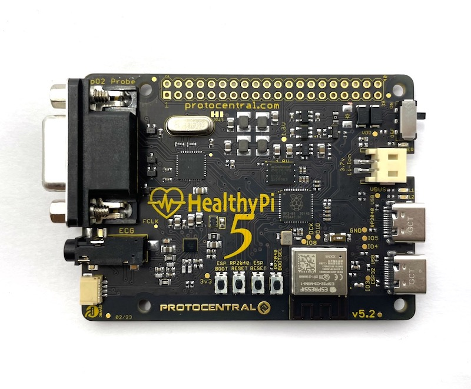

# HealthyPi 5 Zephyr Firmware for RP2040 Main MCU



Don't have one? You can pre-order now at [Crowd Supply](https://www.crowdsupply.com/protocentral/healthypi-5)

HealthyPi 5 is the latest evolution of the HealthyPi series. It is a robust, feature-rich, open-source development board that allows you to explore many different biosignals with minimal effort. Whether you need a simple monitor for a specific vital sign or a complete health-sensor platform, HealthyPi 5 is an extensible solution to to your health-data challenges. Out of the box, it can handle electrocardiogram (ECG), respiration, photoplethysmography (PPG), oxygen saturation (SpO₂), and body temperature data. 

This repository contains the Zephyr port of the firmware for the HealthyPi 5. If you're looking for the Arduino firmware, it's located in its own repository [here](https://github.com/Protocentral/protocentral_healthypi_5_firmware). 

[Zephyr](https://www.zephyrproject.org/) is a real-time operating system (RTOS) that is designed to be used on resource-constrained systems. We chose to use Zephyr for the HealthyPi 5 because it is a robust, well-supported RTOS (backed by the [Linux Foundation](https://www.linuxfoundation.org)), that is easy to use and has a large open source community. The latest release of Zephyr is quite stable and mature and fully supports the RP2040 microcontroller.

This firmware is still in development and is not yet ready for general use. We are working hard to get it ready for release and will update this repository as we make progress. We will also be releasing a Getting Started Guide soon to help you get up and running with the HealthyPi 5. The first release should be ready in time for the HealthyPi 5 [Crowd Supply campaign fulfillment](https://www.crowdsupply.com/protocentral/healthypi-5)

**This repository contains the Zephyr code only for the RP2040 Main MCU on-board the HealthyPi 5. The ESP3C3 Wireless co-processor code is located in it's [own repo here](https://github.com/Protocentral/healthypi5_esp32c3_zephyr)**

## Features

* RP2040 dual-core ARM Cortex M0 microcontroller
* 16 MB onboard flash
* ESP32C3 RISC-V module with BLE and Wi-Fi support
* MAX30001 analog front end for ECG and respiration measurement
* AFE4400 analog front end for PPG
* MAX30205 temperature sensor via onboard Qwiic/I²C connectors
* 40-pin Raspberry Pi HAT connector (also used to connect our Display Add-On Module)
* 1x USB Type-C connector for communication with a computer and programming the RP2040
* 1x USB Type-C connector for programming and debugging the ESP32 module
* Onboard MicroSD card slot
* On-board Li-Ion battery management with charging through USB

## Supported boards

* HealthyPi 5 (RP2040 only)
* HealthyPi 5 (RP2040 only) + Display Add-On Module

## Firmware supported features

Drivers / Module        |    Status     |           |
----------------        | --------------| --------- |
MAX30001 Sensor Driver  | Basic functionality Completed | :white_check_mark:    | 
AFE4400 Sensor Driver   | Basic functionality Completed | :white_check_mark:    |
MAX30205 Sensor Driver  | Basic functionality Completed | :white_check_mark:    |
Display Driver (LCD)    | Basic functionality Completed | :white_check_mark:    |
GUI (LVGL)              | In Progress     | :hourglass: |
SD Card Driver          | Basic functionality Completed | :white_check_mark:    |
USB CDC Driver          | Basic functionality Completed     | :white_check_mark: |
USB MSC Driver          | In Progress     | :hourglass: |
Data Logging module     | In Progress     | :hourglass: |
RP2040 <> ESP32C3 communication | Completed | :white_check_mark: |
OTA updates             | In Progress     | :hourglass: |

## Compiling the firmware

To compile the code for the RP2040, you will need to install the [Zephyr enviroment](https://docs.zephyrproject.org/) and the Zephyr SDK. You can find instructions for installing the SDK [here](https://docs.zephyrproject.org/latest/getting_started/index.html). Once you have the SDK installed, you can compile the code by running the following commands from the root directory of the repository (change the ~/zephyrproject path to the path where you installed Zephyr):

```
source ~/zephyrproject/zephyr/zephyr-env.sh
```
This makes sure that the build system can find the Zephyr SDK. Now, build the binaries by running the following commands

```
west build -p auto -b healthypi5_rp2040 . -- -DBOARD_ROOT=.
west flash
```

## License Information

This product is open source! Please see the LICENSE.md file for more information.

## Getting Started
_Getting Started Guide coming soon..._

## License Information


This product is open source! Both, our hardware and software are open source and licensed under the following licenses:

Hardware
---------

**All hardware is released under the [CERN-OHL-P v2](https://ohwr.org/cern_ohl_p_v2.txt)** license.

Copyright CERN 2020.

This source describes Open Hardware and is licensed under the CERN-OHL-P v2.

You may redistribute and modify this documentation and make products
using it under the terms of the CERN-OHL-P v2 (https:/cern.ch/cern-ohl).
This documentation is distributed WITHOUT ANY EXPRESS OR IMPLIED
WARRANTY, INCLUDING OF MERCHANTABILITY, SATISFACTORY QUALITY
AND FITNESS FOR A PARTICULAR PURPOSE. Please see the CERN-OHL-P v2
for applicable conditions

Software
--------

**All software is released under the MIT License(http://opensource.org/licenses/MIT).**

THE SOFTWARE IS PROVIDED "AS IS", WITHOUT WARRANTY OF ANY KIND, EXPRESS OR IMPLIED, INCLUDING BUT NOT LIMITED TO THE WARRANTIES OF MERCHANTABILITY, FITNESS FOR A PARTICULAR PURPOSE AND NONINFRINGEMENT. IN NO EVENT SHALL THE AUTHORS OR COPYRIGHT HOLDERS BE LIABLE FOR ANY CLAIM, DAMAGES OR OTHER LIABILITY, WHETHER IN AN ACTION OF CONTRACT, TORT OR OTHERWISE, ARISING FROM, OUT OF OR IN CONNECTION WITH THE SOFTWARE OR THE USE OR OTHER DEALINGS IN THE SOFTWARE.

Documentation
-------------
**All documentation is released under [Creative Commons Share-alike 4.0 International](http://creativecommons.org/licenses/by-sa/4.0/).**


You are free to:

* Share — copy and redistribute the material in any medium or format
* Adapt — remix, transform, and build upon the material for any purpose, even commercially.
The licensor cannot revoke these freedoms as long as you follow the license terms.

Under the following terms:

* Attribution — You must give appropriate credit, provide a link to the license, and indicate if changes were made. You may do so in any reasonable manner, but not in any way that suggests the licensor endorses you or your use.
* ShareAlike — If you remix, transform, or build upon the material, you must distribute your contributions under the same license as the original.

Please check [*LICENSE.md*](LICENSE.md) for detailed license descriptions.